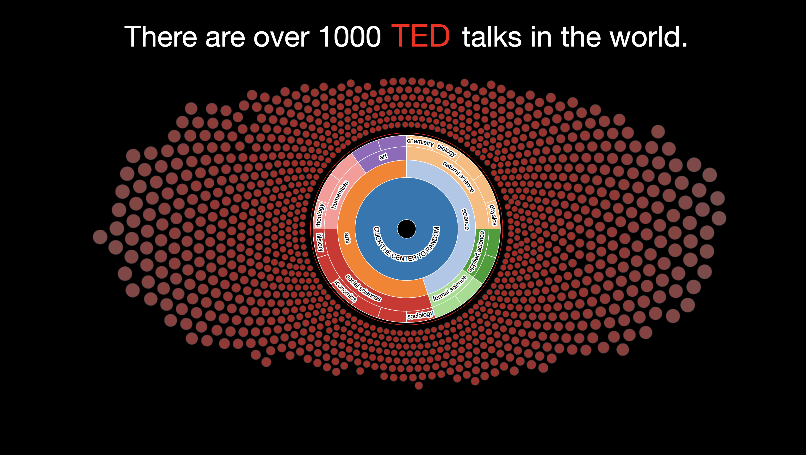
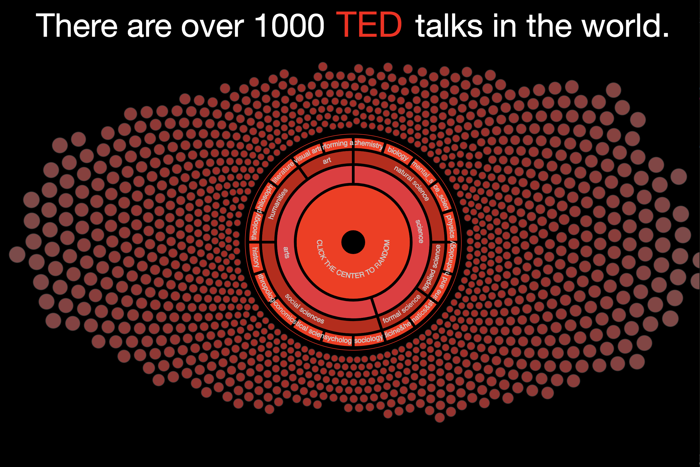

<b>Open the lab2_4.html</b>

Click the bubble to open the video.

Move the mouse over the bubble to see the title of the talk.

Click the Sunburst to select the disciplines and shrink the bubbles.

Click the center of the Sunburst to get a recommendation randomly.

<!DOCTYPE html>
<meta charset="utf-8">
<title>Clustered Force Layout</title>
<head>
  
    
</head>

<body>

